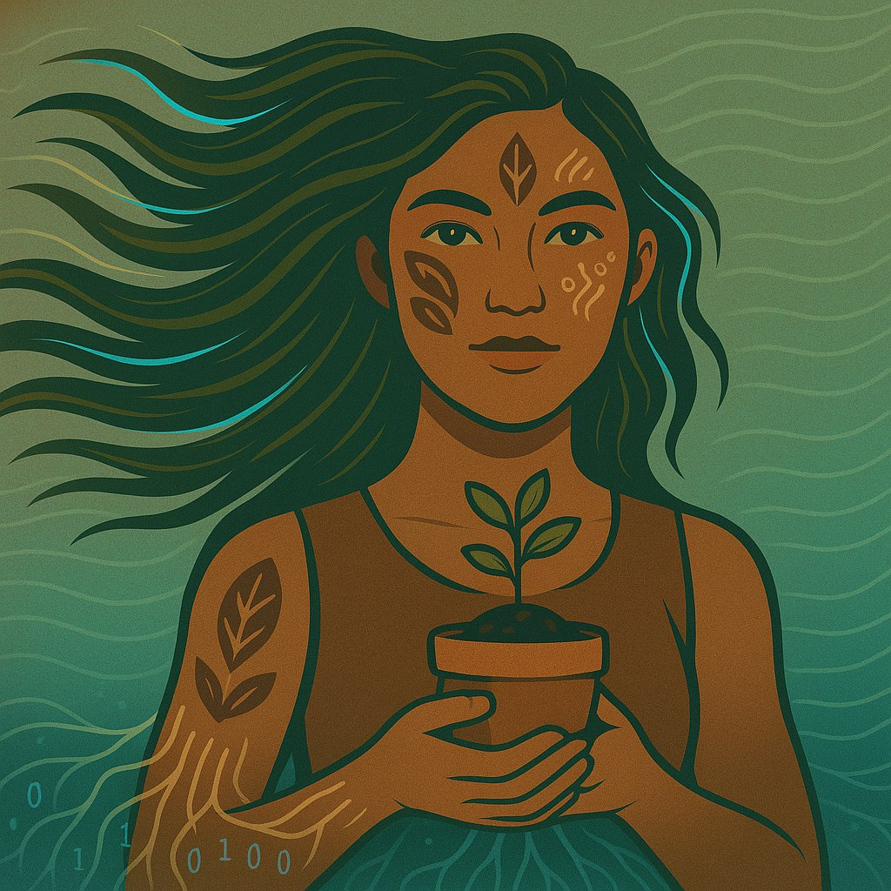

# Amazô.guia — Encontro d’água Hub

> **Tecnologia acessível e sustentável.**

## Visão

A **Amazô.guia** é a evolução da Amazô, agente/chatbot SDR e de recepção, para uma **agente SDR-RAG, representante e guia digital** do Encontro d’água Hub — holding AI-Native fundada por **Lídi Moura**, analista de dados, IA e automações e criadora de soluções tecnológicas com foco em sustentabilidade e impacto social.

No Challenge G10, a agente deverá consultar fontes autorizadas, responder com rastreabilidade, qualificar inicialmente leads e direcionar usuários, clientes B2B, recrutadores e visitantes para o canal público adequado.

## Origem

Este projeto evolui o showcase Typebot da Amazô, mantido separadamente:

- [Repositório do showcase](https://github.com/lidimoura/amazo.ia-showcase)
- [LP pública](https://lidimoura.github.io/amazo.ia-showcase/)
- [Portfólio da Lídi com Link d’Água](https://link.encontrodagua.com/r/portifolio-lidimoura)

O showcase representa a origem visual e conversacional; este repositório representa a evolução técnica para RAG.

## Identidade visual

A identidade combina referências amazônicas, tecnologia acessível e sustentabilidade. A ilustração da Amazô é o avatar principal; a fotografia da samambaia, feita por Lídi Moura no Amazonas, representa território e autoria.

  

| Cor | Hex | Uso |
|---|---|---|
| Marrom profundo | `#391E13` | Texto e base terrosa |
| Verde folha | `#648D3C` | Elementos naturais |
| Verde-lima claro | `#D7F993` | Destaques e estados ativos |
| Rosa-terra | `#D9AAA1` | Acolhimento e detalhes humanos |
| Vinho escuro | `#3E2128` | Profundidade e contraste |

> Fotografia autoral: [samambaia-amazonas.webp](./assets/samambaia-amazonas.webp), registrada por Lídi Moura no Amazonas.

## MVP

O MVP será **read-only e isolado da produção**, com Python, Gemini e arquitetura RAG. A agente deverá:

- consultar documentos institucionais e comerciais aprovados;
- responder em português claro e acessível, citando fontes quando possível;
- reconhecer limites e recusar perguntas sem evidência;
- resistir a prompt injection e não revelar instruções, credenciais ou fontes privadas;
- apresentar links aprovados, como WhatsApp do Hub, WhatsApp da Lídi, portfólio, LP institucional, Link d’Água, CRM ou outro canal autorizado.

No MVP, encaminhar significa **apresentar o canal ao usuário**. Registro automático de leads somente será afirmado após integração validada.

## Fontes e infraestrutura

Os documentos de fonte de verdade serão preparados no Perplexity, revisados por Lídi e enviados posteriormente. O Google Drive poderá apoiar a curadoria; o OCI Object Storage privado poderá armazenar as versões aprovadas; e o Autonomous AI Database poderá ser avaliado como backend vetorial. Nenhuma dessas integrações será ativada sem validação de segurança, custo e capacidade.

| Camada | Estado |
|---|---|
| Documentos do Perplexity | Pendentes de envio e aprovação |
| RAG local | Próximo incremento pedagógico |
| OCI Object Storage | Opção arquitetural |
| Autonomous AI Database | Avaliação posterior |
| Link d’Água e CRM | Integração futura |
| n8n | Fora do MVP |

## Autoria e transparência

O projeto é de autoria e propriedade de **Lídi Moura**, que mantém autonomia sobre produto, escopo, decisões técnicas, configurações, fontes, testes e responsabilidade final.

O **Hub OS NEXUS** é utilizado como infraestrutura metodológica e operacional da holding para aumentar agilidade, organização e qualidade. Seu uso, já validado em projetos pessoais e freelas do Hub, não substitui a autoria nem delega decisões à ferramenta. Manus AI, Gemini, Perplexity, Colab e Antigravity são ferramentas complementares; a curadoria e a validação permanecem com Lídi.

## Segurança e próximos passos

Não serão publicados segredos, PII desnecessária, dados de produção, prompts internos ou credenciais. A construção seguirá incrementos pequenos: fontes aprovadas, ingestão, RAG local, testes, interface, documentação e, depois, infraestrutura e integrações.

O projeto está em **fundação documental**. O primeiro incremento contém `README.md`, `DEVLOG.md` e os ativos visuais aprovados; o agente, as fontes, os testes, a interface e o deploy ainda não estão validados.

## Ecossistema público

- [Encontro d’água Hub](https://hub.encontrodagua.com)
- [Link d’Água](https://link.encontrodagua.com/vitrine)
- [GitHub da Lídi Moura](https://github.com/lidimoura)
- [Hub OS NEXUS](https://github.com/lidimoura/hub-os-nexus)

---

**Lídi Moura — analista de dados, IA e automações | Fundadora do Encontro d’água Hub**
